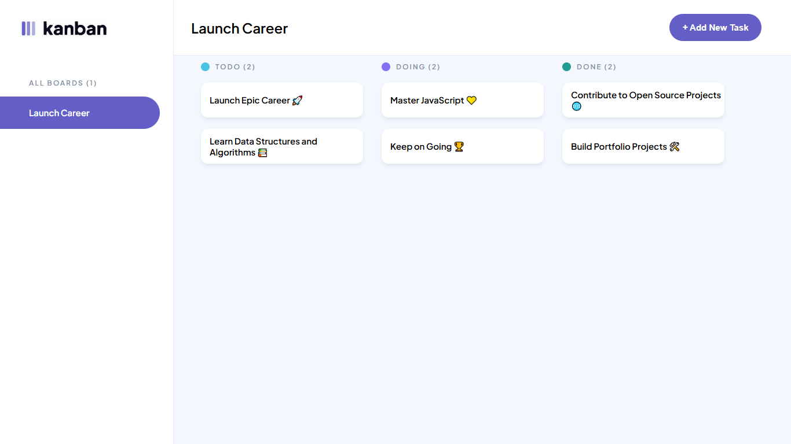
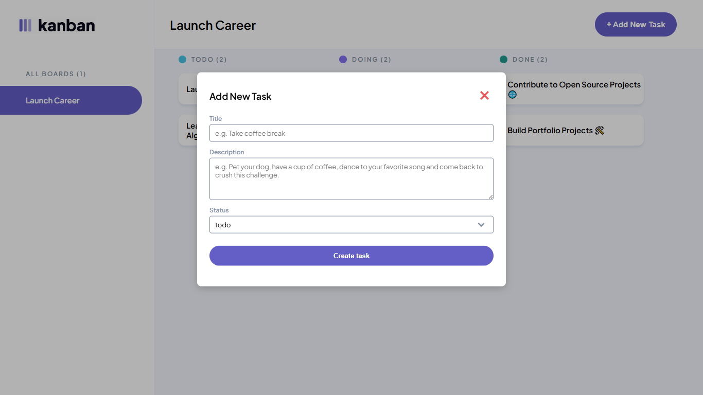
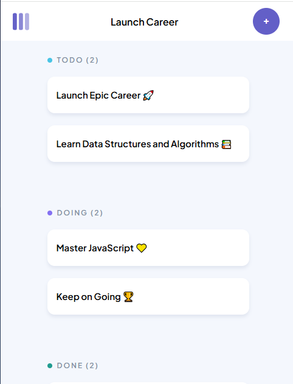

# JSL05 Project Brief: Task Board with Local Storage Persistence and Task Creation

---

## Table of Contents

- [🎯 Prerequisites](#prerequisites)
- [📝 Project Overview](#project-overview)
- [🏆 Key Objectives](#key-objectives)
- [📦 Tech Stack](#tech-stack)
- [🛠️ Usage](#usage)
- [🔧 Code Structure & Maintainability](#code-structure--maintainability)
- [⚙️ Setup & Installation](#setup--installation)
- [📸 Screenshots](#screenshots)
- [🧩 Contributing](#contributing)
- [🙋‍♂️ Contact](#contact)

---

<h2 id="prerequisites">🎯 Prerequisites</h2>

1. Before starting this challenge, ensure that you have **correctly populated your DOM elements** as per the solution in JSL04. Additionally, ensure that clicking a task should **open the modal with the relevant task details** as required in the previous challenge.
2. **Check the project user stories in your student dashboard**, make sure you understand what is required for each feature.

<hr style="border:0; height:2px; background:#ddd;" />

<h2 id="project-overview">📝 Project Overview</h2>

In this project, you will implement a task management system where **tasks are persisted in local storage**, ensuring that tasks remain available even after refreshing the page or reopening the application. Users will be able to **add new tasks**, with the task details being **stored in local storage** and displayed in the appropriate **columns** ("To Do", "Doing", "Done"). The application should also include an **Add Task** modal for creating new tasks.

[Figma Link](https://www.figma.com/design/y7bFCUYL5ZHfPeojACBXg2/Challenges-%7C-JSL?node-id=0-1&p=f&t=mpiLq4hcOoE3Hd3m-0)

<hr style="border:0; height:2px; background:#ddd;" />

<h2 id="key-objectives">🏆 Key Objectives</h2>

**Persistent Task Storage & Retrieval**

- Save new/edited tasks into localStorage
- Load tasks from localStorage on startup
- Categorize them into “To Do,” “Doing,” “Done”

**Task Creation & Modal Interaction**

- “Add Task” button to open a creation modal
- Modal inputs: title, description, status dropdown
- Immediate render on submit

<hr style="border:0; height:2px; background:#ddd;" />

<h2 id="tech-stack">📦 Tech Stack</h2>

- HTML5
- CSS3
- JavaScript (ES6+)

<hr style="border:0; height:2px; background:#ddd;" />

<a name="usage"></a>

<h2 id="usage">🛠️ Usage</h2>

#### Use the Kanban board to:

- Click **“Add Task”** to open the creation modal.
- Fill out details and submit—the task appears immediately.
- Refresh the page to confirm it was saved to local storage.

<hr style="border:0; height:2px; background:#ddd;" />

## 🔧 Code Structure & Maintainability

- **storage.js** handles all localStorage read/write.
- **render.js** takes task data and injects DOM elements.
- **modal.js** manages opening, closing, and form submission.
- Use JSDoc on all public functions; keep modules focused on a single responsibility.

<hr style="border:0; height:2px; background:#ddd;" />

<h2 id="setup--installation">⚙️ Setup & Installation</h2>

#### 1. Clone the Repository

```bash
git clone https://github.com/tawandakasunzuma/TAWKAS25106_FTO2502_A1_Tawanda_Kasunzuma_JSL05.git
cd TAWKAS25106_FTO2502_A1_Tawanda_Kasunzuma_JSL05
```

#### 2. Install Dependencies

```bash
npm install
```

#### 3. Run the Local Server

```bash
npm start
```

<hr style="border:0; height:2px; background:#ddd;" />

<h2 id="screenshots">📸 Screenshots</h2>

#### Homepage (Desktop-view)



#### Add New Task Modal (Desktop-view)



#### Add New Task Modal (Mobile-view)



<hr style="border:0; height:2px; background:#ddd;" />

<h2 id="contributing">🧩 Contributing</h2>

Contributions are welcome! To get started:

1. **Fork** the repository

2. **Create a new branch**

   ```bash
   git checkout -b feature/your-feature
   ```

3. **Commit your changes**

   ```bash
   git commit -m "Add your feature"
   ```

4. **Push to your branch**

   ```bash
   git push origin feature/your-feature
   ```

5. **Open a Pull Request** on Github

<hr style="border:0; height:2px; background:#ddd;" />

<a name="contact"></a>

<h2 id="contact">🙋‍♂️ Contact</h2>

For questions or feedback, reach out to:
📧 tskasunzuma@gmail.com
